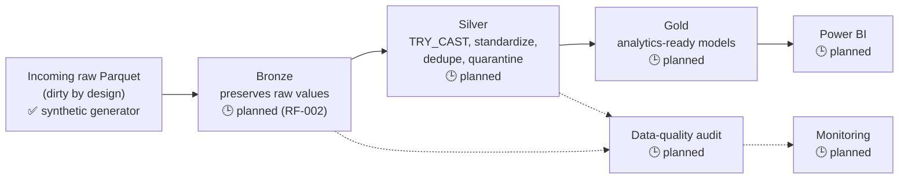
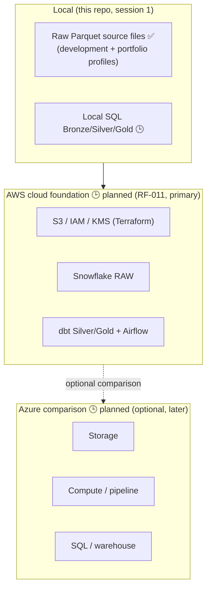
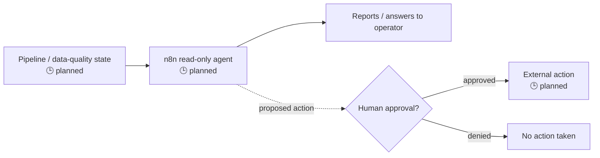

# Architecture

This document shows the target end-to-end architecture for the RetailFlow
platform. **Most of this is planned, not implemented.** See
[PROJECT_CONTEXT.md](../PROJECT_CONTEXT.md) for current status.

## Legend

- ✅ Implemented today
- 🕒 Planned (documentation/scaffolding only)

## Data flow (medallion architecture)

## Local vs. cloud implementations

AWS is built first as the primary cloud implementation (RF-011); Azure is
an optional, later comparison exercise (see [DECISIONS.md](../DECISIONS.md)
#010, which supersedes #003's Azure-first sequencing). Cloud resource
mapping notes are in [cloud_mapping.md](cloud_mapping.md).

## Operations agent (n8n)

The agent can observe and report on pipeline/data state. It cannot take any
externally-visible action without a human approving that specific action —
see [DECISIONS.md](../DECISIONS.md) #005 and
[agentic_ai_scope.md](agentic_ai_scope.md).

## Component status summary

| Component                     | Status |
|--------------------------------|--------|
| Synthetic raw source-data generator (Parquet, development + portfolio) | ✅ Implemented |
| Bronze ingestion (preserves raw values) | 🕒 Planned (RF-002) |
| Silver transformation (cast, standardize, dedupe, quarantine) | 🕒 Planned |
| Gold aggregation                | 🕒 Planned |
| Data-quality audit              | 🕒 Planned |
| AWS cloud foundation (Terraform, primary) | 🕒 Planned (RF-011) |
| Azure comparison (optional, later) | 🕒 Planned |
| Power BI dashboards             | 🕒 Planned |
| n8n read-only operations agent  | 🕒 Planned |
| Monitoring                      | 🕒 Planned |
| CI/CD                           | 🕒 Planned |
